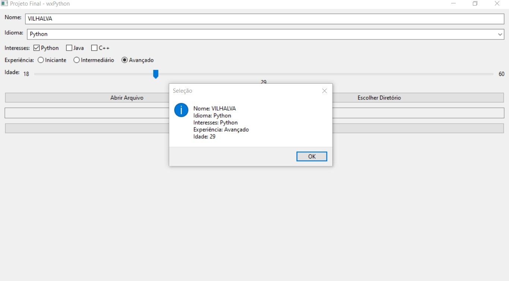

# PROJETO WXPYTHON
👨‍🏫PROJETO FEITO PARA O CURSO DE WXPYTHON.

 <br>

## DESCRIÇÃO:
Este projeto em wxPython é uma aplicação de interface gráfica que combina diversos componentes para interação do usuário. Aqui está uma descrição detalhada das funcionalidades:

1. **Campos de Entrada:**
   - **Nome:** Permite ao usuário inserir seu nome.
   - **Idioma:** Uma combobox que oferece opções para selecionar o idioma preferido.
   
2. **Seleção de Interesses:**
   - **Interesses:** Checkboxes para marcar os interesses do usuário em diferentes linguagens de programação (Python, Java, C++).

3. **Seleção de Experiência:**
   - **Experiência:** Radiobuttons para escolher o nível de experiência do usuário em programação (Iniciante, Intermediário, Avançado).

4. **Seleção de Idade:**
   - **Idade:** Um slider que permite ao usuário escolher sua idade dentro de um intervalo definido.

5. **Botões:**
   - **Abrir Arquivo:** Ao clicar neste botão, um diálogo de seleção de arquivo é exibido, permitindo ao usuário escolher um arquivo. O caminho do arquivo selecionado é exibido em um campo de texto.
   - **Escolher Diretório:** Clica-se neste botão para abrir um diálogo de seleção de diretório, onde o usuário pode escolher um diretório. O caminho do diretório selecionado é mostrado em um campo de texto.
   - **Mostrar Seleção:** Ao clicar neste botão, uma caixa de mensagem é exibida mostrando todos os dados coletados dos campos de entrada.

## COMO USAR?
1. **Instalando as dependências:**
   - Antes de executar o aplicativo, certifique-se de instalar todas as dependências necessárias. No terminal, execute o seguinte comando para instalar as dependências listadas no arquivo `requirements.txt` no diretório: `CODIGO`:
   ```bash
   pip install -r requirements.txt
   ```
   - Isso instruirá o pip a ler o arquivo requirements.txt e instalar todas as dependências listadas.

2. **Execução do Código:**
   - Execute o arquivo, no diretório `CODIGO`, usando o comando:
     ```sh
     python CODIGO.py
     ```

3. **Preenchimento de Dados:**
   - Insira seu nome no campo de texto "Nome".
   - Escolha seu idioma preferido na combobox "Idioma".
   - Marque os interesses em linguagens de programação que você possui.
   - Escolha seu nível de experiência em programação usando os radiobuttons.
   - Utilize o slider para selecionar sua idade.

4. **Operações com Arquivos e Diretórios:**
   - **Abrir Arquivo:**
     - Clique no botão "Abrir Arquivo".
     - Selecione um arquivo na janela de diálogo que aparece.
     - O caminho do arquivo selecionado será exibido no campo de texto abaixo dos botões.
   - **Escolher Diretório:**
     - Clique no botão "Escolher Diretório".
     - Selecione um diretório na janela de diálogo que aparece.
     - O caminho do diretório selecionado será exibido no mesmo campo de texto.

5. **Mostrar Seleção:**
   - Após preencher todos os campos desejados e selecionar arquivos/diretórios se necessário, clique no botão "Mostrar Seleção".
   - Uma caixa de mensagem será exibida mostrando todos os dados que você inseriu e selecionou.

6. **Encerramento do Programa:**
   - Feche a janela principal para encerrar o programa.

## CREDITOS:
- [PROJETO CRIADO PELO VILHALVA](https://github.com/VILHALVA)
- [PROJETO FEITO PARA O CURSO DE WXPYTHON](https://github.com/VILHALVA/CURSO-DE-WXPYTHON)


